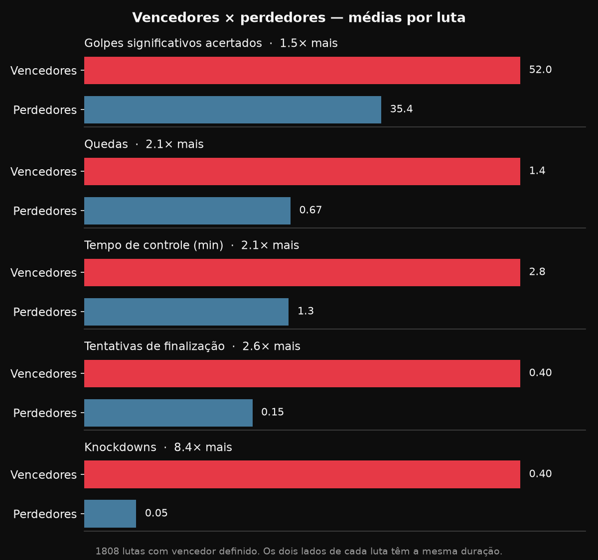

# UFC Data — Análise Estatística de MMA

🔗 **[Ver os gráficos](https://khannnn1.github.io/ufc-data/)** · **[Explorar os dados (interativo)](https://khannnn1.github.io/ufc-data/interativo.html)**

Projeto de ponta a ponta com dados de lutas do UFC: **coleta** por web scraping, **limpeza** e **análise** em Python e **SQL**, **visualização** em estilo editorial (inspirado em contas de dados esportivos como @DataFut) e um **site interativo** em JavaScript, onde o visitante compara lutadores e monta os próprios rankings.



## Destaques da análise

Recorte de **149 eventos recentes do UFC, de abril de 2023 (UFC 287) a setembro de 2026 (UFC 331): 1.837 lutas e 964 lutadores**.

- **Metade das lutas termina antes da decisão dos juízes:** 32% por nocaute e 17% por finalização.
- **Knockdown é o que mais separa vencedores de perdedores:** quem vence derruba o adversário 8,4× mais. Nos golpes significativos a diferença é bem menor (1,5×): quem perde também troca bastante.
- **A luta se decide no chão:** vencedores acertam 13% dos golpes no chão, contra 3,5% dos perdedores, quase 4× mais.
- **Nocautes acontecem mais cedo que finalizações:** 54% dos nocautes saem no 1º round, contra 46% das finalizações, que pesam mais no 2º e 3º rounds.
- **Volume e precisão quase não se relacionam** (correlação de −0,15): há lutadores de todos os estilos, de quem arrisca muito a quem espera o golpe certo.
- **63% dos golpes significativos acertam a cabeça**, mas há especialistas que acertam mais nas pernas do que em qualquer outro alvo.
- **Idade pesa mais que envergadura:** o lutador mais novo vence 60% das lutas (73% quando a diferença passa de 8 anos); quem tem mais envergadura, tão citada nas transmissões, vence só 51%, quase cara ou coroa.
- **A vantagem do canhoto é pequena:** contra ortodoxos, o canhoto vence 53% de 465 lutas, mas o intervalo de 95% (48% a 57%) inclui os 50%. Com essa amostra, não dá para descartar o acaso.
- **Disputas de cinturão têm o mesmo ritmo, mas levam mais bônus:** 4 golpes significativos por minuto, como nas demais lutas, mas Luta da Noite em 18% delas, contra 5%.
- **A Luta da Noite premia a troca, não a finalização rápida:** ritmo 1,5× maior (5,8 golpes por minuto contra 3,8), o perdedor também derruba o adversário em 12% delas (4% nas demais), e 65% vão para a decisão. Só 3% acabam no 1º round, porque a finalização rápida leva a Performance da Noite.
- **O meio-pesado é a divisão que mais encerra lutas antes da decisão (68%)**, à frente até do peso-pesado (53%). Nas divisões mais leves e nas femininas, os nocautes caem pela metade e a finalização passa a pesar tanto quanto eles.

## O site

- **[Gráficos](https://khannnn1.github.io/ufc-data/)** (`index.html`): 22 gráficos com a leitura de cada um.
- **[Explorar os dados](https://khannnn1.github.io/ufc-data/interativo.html)** (`interativo.html`):
  - **Comparar lutadores:** escolha dois lutadores quaisquer e veja categoria, cartel, idade, altura, envergadura, base e médias por luta lado a lado. Uma caixa "No papel" diz quem é mais novo, quem tem mais envergadura e como se saiu cada base no confronto (canhoto × ortodoxo etc.), com a taxa de vitória no período e o aviso quando a diferença cabe no acaso.
  - **Round a round:** como os dois lutadores do comparador rendem do 1º ao 5º round (golpes, precisão, quedas ou controle), contra a média de todos.
  - **Volume × precisão:** dispersão com todos os lutadores; os dois do comparador aparecem destacados, e passar o mouse mostra quem é cada ponto.
  - **Monte o seu ranking:** escolha a métrica (13 opções), filtre por categoria de peso, base (ortodoxo, canhoto, troca de base) e faixa de idade, e escolha o mínimo de lutas e o tamanho do top. Clique numa barra para levar o lutador ao comparador. Exemplo: [knockdowns no peso-mosca](https://khannnn1.github.io/ufc-data/interativo.html?m=kd&cat=Flyweight#ranking), [taxa de vitória dos canhotos](https://khannnn1.github.io/ufc-data/interativo.html?m=taxa_vitoria&base=Southpaw#ranking).
  - **Compartilhe:** a comparação e o ranking escolhidos ficam no endereço da página, e o botão "Copiar link" gera um link que abre exatamente aquela tela. Exemplo: [Alex Pereira × Jon Jones](https://khannnn1.github.io/ufc-data/interativo.html?a=Alex+Pereira&b=Jon+Jones#comparador).

## Pipeline

```
ufcstats.com
   │  scraper.py (Selenium + BeautifulSoup): páginas de luta, de evento e de lutador;
   │  atualizar.py busca só o que falta (eventos novos, lutadores novos)
   ▼
data/raw/*.csv
   │  limpeza.py
   ▼
data/processed/*.csv
   ├──► notebooks (Matplotlib) ──► figures/*.png ──► index.html
   ├──► exportar.py ──► dados/lutadores.json ──► interativo.html (Chart.js)
   └──► banco.py ──► data/ufc.db (SQLite) ──► sql/consultas.sql
```

1. **Coleta** (`src/scraper.py`): o ufcstats.com bloqueia requisições simples com uma verificação anti-bot que exige JavaScript, então a coleta usa Selenium em modo headless e lê o HTML depois que a página carrega. As tabelas de estatísticas trazem os dois lutadores na mesma célula, e o `pandas.read_html` não separa isso, por isso o parsing é feito manualmente com BeautifulSoup. A coleta em lote salva cada evento no CSV assim que termina, para não perder o progresso se a conexão cair. Três tipos de página: a da **luta** (estatísticas, no total e por round), a do **evento** (categoria de peso, disputa de cinturão e bônus de Luta/Performance da Noite, marcados por ícones na tabela, e o link de cada lutador) e a do **lutador** (altura, envergadura, base e data de nascimento). Como só o primeiro acesso passa pela verificação anti-bot, as páginas de lutador esperam o conteúdo aparecer em vez de uma pausa fixa: os 964 lutadores levam ~30 min, e não ~2 h.
2. **Limpeza** (`src/limpeza.py`): converte `"181 of 305"` em duas colunas numéricas (acertados/tentados), percentuais em número, tempos `M:SS` em segundos e medidas em pés e polegadas (`5' 11"`) em centímetros. `"---"` (nenhuma tentativa) vira ausente, e não 0%.
3. **Análise e gráficos** (`notebooks/02_visualizacao.ipynb` + `src/visualizacao.py`): padrão visual único (fundo escuro, barras com o valor escrito na ponta, sem eixo quando ele não acrescenta).
4. **Exportação** (`src/exportar.py`): agrega os totais por lutador (no geral e por round) e os dados físicos em um JSON pequeno (≈360 KB); médias, percentuais e idade são calculados no navegador.
5. **SQL** (`src/banco.py`, `sql/`, `notebooks/03_sql.ipynb`): os CSVs, com uma linha por lutador em cada luta e os dados da luta repetidos, viram um banco SQLite com cinco tabelas relacionadas — `eventos` → `lutas` → `desempenho` → `desempenho_round`, mais `lutadores` ligada a `desempenho` —, com chaves primárias e estrangeiras. As perguntas dos gráficos são respondidas de novo em SQL (JOINs, inclusive *self-join* para pôr o vencedor e o perdedor de cada luta lado a lado, `GROUP BY`/`HAVING` para as amostras mínimas, datas com `julianday()` para a idade de cada lutador no dia da luta, CTEs e funções de janela como `RANK`, `ROW_NUMBER` e `SUM() OVER (PARTITION BY ...)`), e o notebook **confere cada resposta com o resultado em Pandas**. Três consultas só existem em SQL: o destaque de cada evento, a maior sequência de vitórias de cada lutador (*gaps and islands*) e como as lutas terminam ano a ano — onde aparece, por exemplo, a taxa de nocaute subindo de 28% (2024) para 37,5% (2026, parcial).
6. **Testes** (`tests/`, `pytest`): 22 testes rodam em ~1 s, sem internet e sem os dados coletados. Eles usam páginas HTML mínimas no formato do ufcstats e um mini-dataset sintético com 3 lutas. Cobrem a limpeza (`"X of Y"`, `"---"` como ausente, `M:SS`, pés e polegadas), o parsing das páginas de evento e de listagem, o desempate dos rankings, a separação de homônimos e as faixas do comparador. Também montam o banco SQLite em memória com o `schema.sql` real, com chaves estrangeiras ligadas, e rodam todas as consultas nomeadas.

## Decisões de análise

Alguns cuidados que mudam o resultado e que estão aplicados nos gráficos:

- **Médias por luta, não somas**, ao comparar lutadores com números de lutas diferentes.
- **Amostra mínima em todo ranking de taxa ou precisão** (ex.: taxa de vitória só com 6+ lutas; precisão de quedas com 15+ tentativas e 3+ lutas). Sem isso, o topo vira quem tentou pouco e acertou tudo.
- **Uma linha por luta** quando a pergunta é sobre lutas. O dataset tem uma linha por lutador em cada luta, e contar direto dobraria tudo (um erro que o projeto teve e corrigiu).
- **Volume por minuto, não por luta**, para não penalizar quem finaliza cedo.
- **Associação não é causa**, e isso aparece nas legendas: um knockdown muitas vezes já é o começo do fim da luta; a taxa de finalização de um árbitro reflete as lutas que ele recebe, não o estilo dele.
- **Intervalo de confiança quando a diferença é pequena**: no confronto de bases, 53% contra 50% parece vantagem, mas o intervalo de 95% mostra que a amostra não sustenta a conclusão.
- **Viés de sobrevivência**: rounds avançados só existem em lutas longas, então médias por round não comparam as mesmas lutas.
- **Nome não é identificador**: existem dois "Bruno Silva" diferentes no período (um peso-médio e um peso-mosca). O link da página de cada lutador é a chave; quando dois nomes coincidem, o nome exibido ganha o ano de nascimento, "Bruno Silva (1989)" e "Bruno Silva (1990)", para as estatísticas não se misturarem.
- **Desempate estável nos rankings**: com 15 lutadores empatados em 7 vitórias disputando 8 vagas, quem aparecia no top 10 mudava a cada atualização. Nos totais, em empate vem antes quem precisou de menos lutas; em médias e taxas, quem tem mais lutas (amostra maior); por último, a ordem alfabética.

## Gráficos

| Tema | Gráficos |
|---|---|
| Como as lutas terminam | métodos de vitória · round em que as lutas terminam, por método · lutas encerradas antes da decisão, por categoria de peso e por árbitro |
| O que decide a luta | vencedores × perdedores · de onde saem os golpes (distância, clinch, chão) · idade × envergadura |
| Estilo de luta | volume × precisão (dispersão) · onde os golpes acertam (cabeça, corpo, perna) · evolução de golpes por round |
| Rankings | vitórias · taxa de vitória · nocautes · finalizações · knockdowns · tempo de controle · precisão de golpes · precisão de quedas |
| Lutadores | comparação cara a cara entre dois lutadores |

Todas as imagens estão em [`figures/`](figures/), e o código de cada uma em [`notebooks/02_visualizacao.ipynb`](notebooks/02_visualizacao.ipynb).

## Stack

**Python** (Pandas, NumPy, Matplotlib, Selenium, BeautifulSoup, Jupyter, pytest) · **SQL** (SQLite) · **JavaScript** (Chart.js) · **HTML/CSS** · **Git** (Git Flow) · **GitHub Pages**

## Estrutura do projeto

```
├── data/                  # CSVs brutos e limpos (não versionados)
├── dados/lutadores.json   # dados agregados que o site interativo lê
├── figures/               # gráficos exportados (.png)
├── js/interativo.js       # lógica do site interativo
├── notebooks/
│   ├── 00_teste_ambiente.ipynb
│   ├── 01_scrapper_test_luta.ipynb   # coleta e limpeza
│   ├── 02_visualizacao.ipynb         # análise e gráficos
│   └── 03_sql.ipynb                  # as mesmas perguntas em SQL
├── sql/
│   ├── schema.sql         # esquema do banco (5 tabelas)
│   └── consultas.sql      # consultas SQL
├── src/
│   ├── scraper.py         # coleta (Selenium + BeautifulSoup)
│   ├── atualizar.py       # busca eventos novos e regenera tudo
│   ├── limpeza.py         # tratamento dos dados
│   ├── visualizacao.py    # padrão visual e funções de plotagem
│   ├── exportar.py        # gera dados/lutadores.json
│   ├── banco.py           # monta o banco SQLite
│   ├── consultas.py       # executa as consultas de sql/consultas.sql
│   └── config.py          # constantes
├── tests/                 # testes automatizados (pytest)
├── index.html             # página com os gráficos
├── interativo.html        # comparador e rankings
└── requirements.txt
```

## Como rodar

```bash
python -m venv venv
venv\Scripts\Activate.ps1          # Windows (Linux/macOS: source venv/bin/activate)
pip install -r requirements.txt
```

- **Coleta e limpeza:** `notebooks/01_scrapper_test_luta.ipynb` (precisa do Google Chrome instalado para o Selenium).
- **Atualizar com eventos novos:** `python -m src.atualizar` busca só os eventos mais recentes que o último da base (e as páginas de evento e de lutador que faltarem), limpa os dados e regenera o JSON do site e o banco SQL; com `--graficos`, também reexecuta os notebooks de gráficos e SQL.
- **Gráficos:** `notebooks/02_visualizacao.ipynb`.
- **SQL:** `notebooks/03_sql.ipynb` recria o banco (`data/ufc.db`) e roda as consultas. Para só gerar o banco: `python -m src.banco`.
- **Dados do site interativo:** `python -m src.exportar` (na raiz do projeto) regenera `dados/lutadores.json`.
- **Testes:** `python -m pytest` (na raiz do projeto).
- **Ver o site localmente:** `python -m http.server` e abrir `http://localhost:8000`. Abrir o HTML direto do disco não funciona, porque o navegador bloqueia a leitura do JSON.

## Próximos passos

- Rodar `python -m src.atualizar --graficos` a cada novo evento do UFC.
