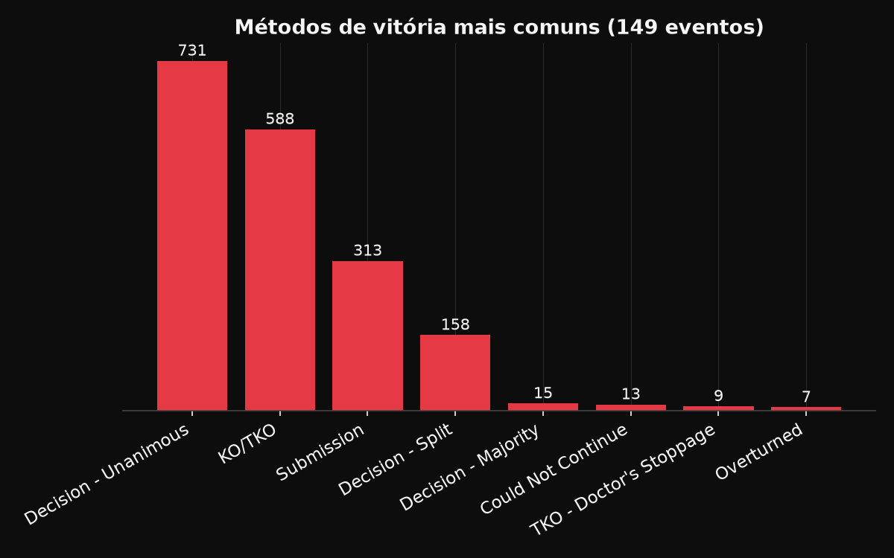
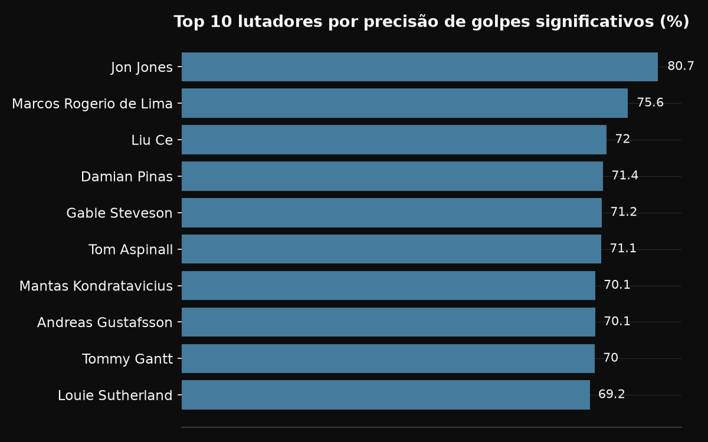
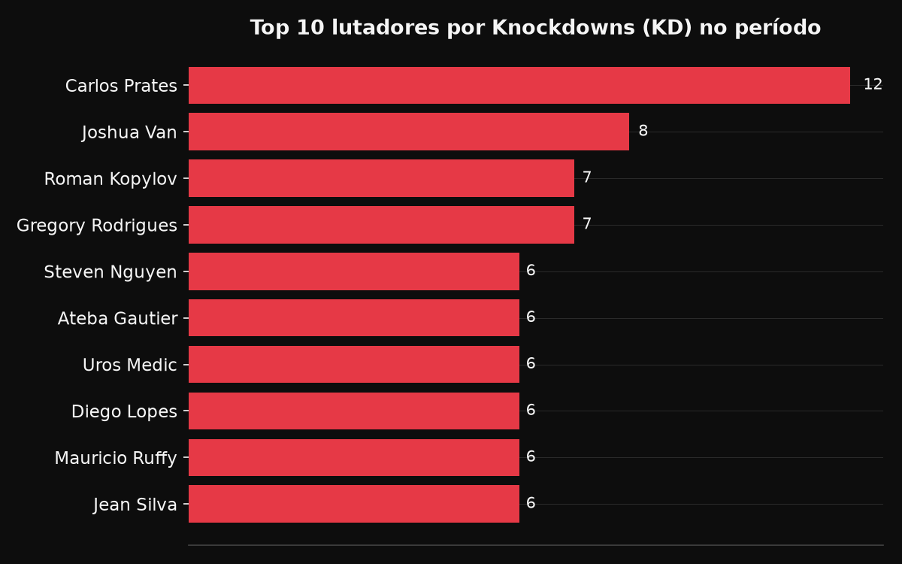
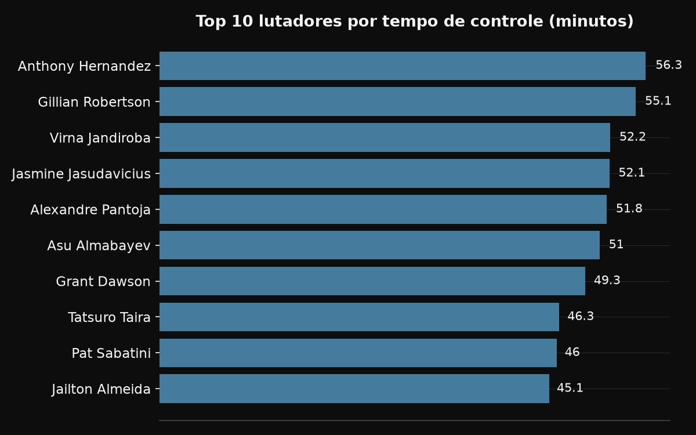

# UFC Data — Análise Estatística de MMA

Projeto de coleta, tratamento e visualização de dados de lutas do UFC, com estilo editorial inspirado em contas de dados esportivos como @DataFut.

## O que o projeto faz

- **Coleta (web scraping):** extrai dados de lutas, eventos e estatísticas detalhadas (golpes, quedas, controle de posição) direto do [ufcstats.com](http://ufcstats.com), usando Selenium (para contornar a proteção anti-bot do site) e BeautifulSoup.
- **Limpeza e tratamento:** converte campos de texto (ex: `"181 of 305"`, `"59%"`) em dados numéricos prontos para análise, tratando casos de borda (valores ausentes, lutas sem tentativas de determinada ação).
- **Visualização:** gráficos em dark mode / estilo editorial, feitos com Matplotlib, pensados para leitura rápida em redes sociais.

## Escopo dos dados

149 eventos do UFC (os mais recentes disponíveis no momento da coleta), totalizando aproximadamente 3.700 registros de lutador-luta e 8.900 linhas de estatísticas por round.

## Alguns resultados

**Métodos de vitória mais comuns**


**Top 10 por precisão de golpes significativos**


**Top 10 por Knockdowns**


**Top 10 por tempo de controle**


## Stack

Python · Selenium · BeautifulSoup · Pandas · Matplotlib · Jupyter

## Estrutura do projeto
├── data/
│ ├── raw/ # dados brutos extraídos do scraper (não versionados)
│ └── processed/ # dados limpos, prontos para análise (não versionados)
├── figures/ # gráficos exportados
├── notebooks/
│ ├── 00_teste_ambiente.ipynb # validação inicial do ambiente
│ ├── 01_scrapper_test_luta.ipynb # coleta e limpeza
│ └── 02_visualizacao.ipynb # geração dos gráficos
├── src/
│ ├── scraper.py # funções de coleta (Selenium + BeautifulSoup)
│ ├── limpeza.py # funções de tratamento de dados
│ └── visualizacao.py # estilo visual e funções de plotagem
└── requirements.txt


## Como rodar

```bash
python -m venv venv
venv\Scripts\Activate.ps1   # Windows
pip install -r requirements.txt
```

Depois, abra os notebooks em `notebooks/` no VS Code ou Jupyter, na ordem: `00` → `01` → `02`.

## Próximos passos

- Gráfico comparativo direto entre dois lutadores
- Análise de evolução de desempenho por round
- Página/dashboard estático para publicação do projeto